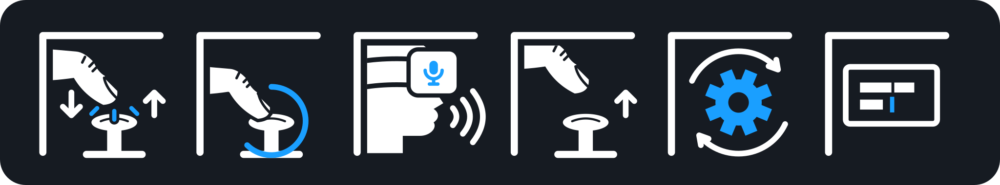
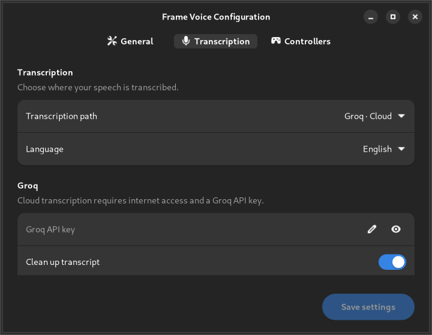

<h1>
  <picture>
    <source media="(prefers-color-scheme: dark)" srcset="assets/icons/frame-voice-header-dark.svg" />
    
  </picture>
</h1>

Voice dictation for Steam Frame. Speak into a text field using your controllers,
without a keyboard or an always-on microphone.

**Desktop** is the Frame's built-in desktop session. **Standalone apps**, such as
Firefox launched directly from Steam, run outside Desktop. Frame Voice types
into both; accented and non-Latin text currently requires a standalone app.
Dictation is unavailable inside Steam menus and VR games.

## Install on your Frame

1. Open **Desktop**, then open **Konsole** (the terminal).
2. Paste this command and press Enter:

   ```sh
   curl -fsSL https://raw.githubusercontent.com/techieyann/frame-voice/main/get.sh | sh
   ```

3. The GUI installer opens in Desktop. Choose how your speech is transcribed.
   If asked, enter your SteamOS administrator password to allow text input. If you have never set
   that password, run `passwd` in Konsole first.
4. Find the Frame Voice microphone icon in the Desktop tray.

## Choose transcription and language

| Model | Runs on | Speed | Accuracy | Internet needed | Requirements |
| --- | --- | --- | --- | --- | --- |
| Whisper Base | Local | Medium | Iffy | Initial download only | ~142MiB |
| Whisper Small | Local | Slow | Good | Initial download only | ~466MiB |
| Whisper Large v3 Turbo | Groq | Fast | Best | Every dictation | [API key](https://console.groq.com/keys) |

Whisper models were created by [OpenAI](https://github.com/openai/whisper). Local transcription sends no audio to OpenAI or Groq; the models run on your Frame using [whisper.cpp](https://github.com/ggml-org/whisper.cpp).

Choose **Language** in the Transcription tab, or **Automatic detection** if you
use more than one language. Local setup downloads the appropriate English or
multilingual model. Groq needs no language-specific download.

## Try your first dictation



1. Open Firefox, start a new tab, and click its address bar.
2. Briefly touch either joystick cap, lift your thumb, then touch it again and hold.
3. Wait for the start tone and microphone badge, then speak.
4. Lift your thumb to finish. Wait for the transcription to appear.

Click the joystick during recording to cancel. After text appears, **A** submits
and **X** clears. On the left hand, **D-pad Right** submits and **D-pad Left** clears.
These actions are available briefly after dictation and stop when you change
focus. Nothing submits automatically.

Open **Configure…** in the tray to customize Frame Voice. See the
[settings guide](docs/SETTINGS.md) for the General, Transcription, and Controllers tabs.



*The configuration window: choose a transcription path and language, then save.*

## If something does not work

Check that dictation is running in the tray and that an app's text field is
focused. Use **View recent logs** in the tray for more detail, or follow the
[troubleshooting guide](docs/TROUBLESHOOTING.md).

[Settings](docs/SETTINGS.md) · [Troubleshooting](docs/TROUBLESHOOTING.md) ·
[Release notes](docs/RELEASE-NOTES.md) · [Developer guide](docs/DEVELOPMENT.md) ·
[License](LICENSE)
